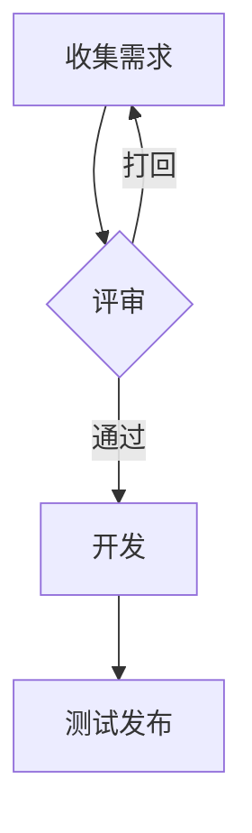

# 办公文档转换样本

这是一份**端到端测试**用的 Markdown 样本,覆盖 `*斜体*`、`行内代码`、
[链接](https://example.com)与中文排版。

## 数据表格

| 产品 | 数量 | 单价(元) | 小计 |
|:-----|-----:|---------:|-----:|
| 苹果 | 12 | 5.5 | 66.0 |
| 香蕉 | 20 | 3.0 | 60.0 |
| 橙子 | 8 | 6.5 | 52.0 |

> 引用块:用于验证 md → PDF/docx 的引用样式。

## 代码示例

```python
def calc(total: float, rate: float = 0.1) -> float:
    """计算含税金额"""
    return total * (1 + rate)
```

## 流程图



## 列表

- 一级列表项
- 第二项
  - 嵌套子项 A
  - 嵌套子项 B
    1. 有序子项
    2. 有序子项

## 图片


## 结论

多格式转换链路:md → PDF(保样式)、md → docx、docx → md、pdf → docx。
